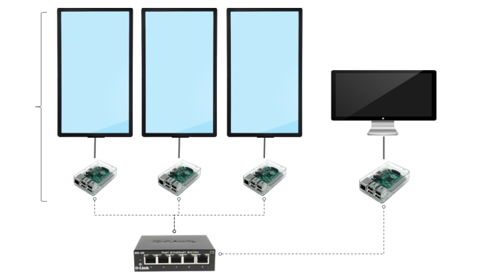

# Pi Wall - Georgetown Maker Hub Documentation

Pi Wall Official Docs
http://piwall.co.uk/

Google Groups Support Forum
https://groups.google.com/forum/?hl=en-GB#!forum/piwall-users

Matthew Epler's Pi Wall Tutorial
http://matthewepler.github.io/2016/01/05/piwall.html

## Hardware Requirements
1. Raspberry Pis
2. Monitors and HDMI cables
3. Ethernet Switch (D-link for maker hub-- b/c it works)
4. Mounting hardware?


## Technical Schematic

Google Slides URL
https://docs.google.com/presentation/d/1myFOl4jbru_muShOQTJg2CYzb3ZMEWcTkCiGhK4sLzY/edit#slide=id.p


## Basic Setup

1. Install raspbian and update distribution

```
# Update Raspbian Distro
sudo apt-get update
```

2. Download and install piwall and pwomxplayer

```
# Install piwall
sudo dpkg -i /home/pi/piwall.deb

# Install pwomxplayer
sudo dpkg -i /home/pi/pwomxplayer.deb
sudo apt-get install libgtk-3-dev
sudo apt-get install libgtk-3-dev --fix-missing
```

3. Configure network settings

```
# Create config files
touch ~/.piwall
touch ~/.pitile
```

4. Setup monitors in semi-permanent arrangement
5. Configure .piwall and .pitile files to reflect position and air gaps.
6. Run test broadcasts over UDP w/sample video file to demo concept proof.

## Advanced Setup

1. Develop auto-run and video loop scripts
2. Package everything into an auto-install script
