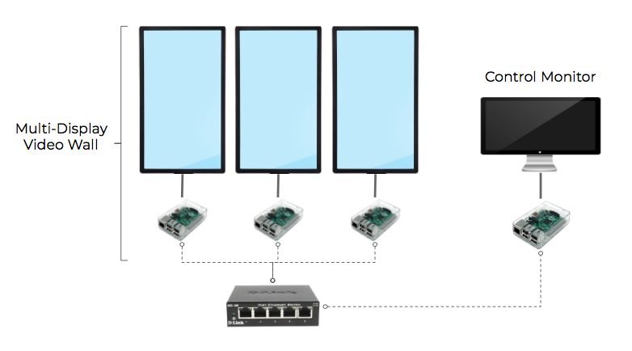

# Pi Wall - Georgetown Maker Hub Documentation

Pi Wall Official Docs
http://piwall.co.uk/

Google Groups Support Forum
https://groups.google.com/forum/?hl=en-GB#!forum/piwall-users

Matthew Epler's Pi Wall Tutorial
http://matthewepler.github.io/2016/01/05/piwall.html

## Hardware Requirements
1. Raspberry Pis
2. Monitors and HDMI cables
3. Ethernet Switch (D-link for maker hub-- b/c it works)
4. Mounting hardware?

## Technical Schematic

Google Slides URL
https://docs.google.com/presentation/d/1myFOl4jbru_muShOQTJg2CYzb3ZMEWcTkCiGhK4sLzY/edit#slide=id.p

## Basic Setup

1. Get pi
2. Install raspbian
3. Update
4. Download Pi Wall and pwomxplayer
5. Download required packages for pwomxplayer
... > sudo apt-get install libgtk-3-dev
6. Network Config Setup
7. .piwall and .pitile setup
8. Run test broadcasts over UDP w/sample video file.
9. Create auto-run scripts
10. Package everything into an auto-install script
